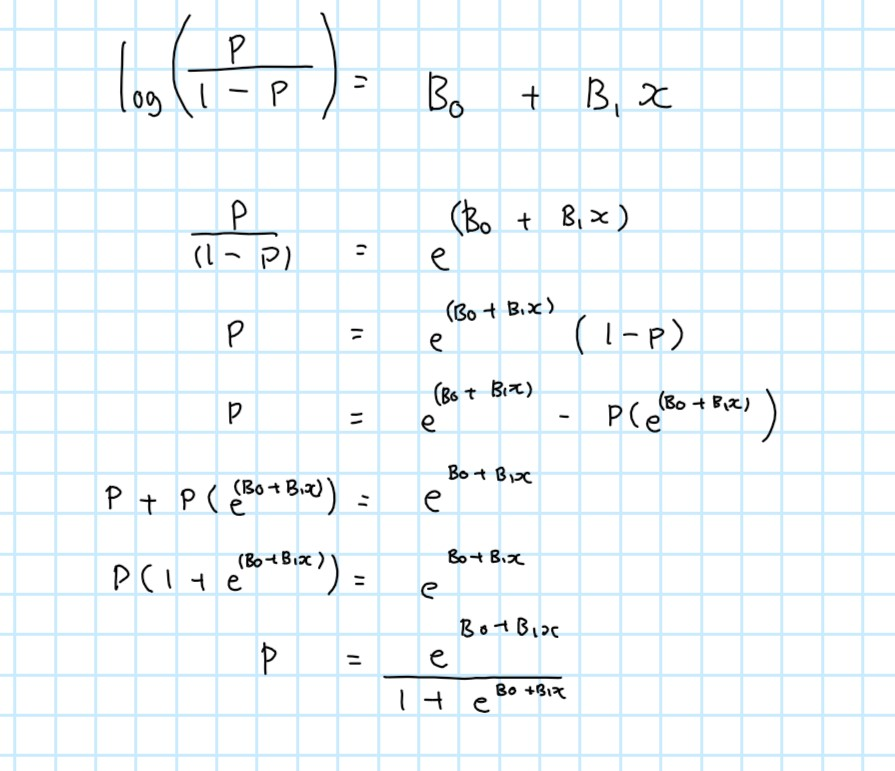

```{r setup, include=FALSE}
knitr::opts_chunk$set(echo = TRUE)
library(tidyverse)
library(dplyr)
library(s20x)
```

It seems reasonable to assume that the `mass` of a planet should be related to the cube of the `diameter` as they are (mostly) very close to being spheres.

# MOONS DATA 

```{r}
Moons.df <- read.csv("Moons.csv")
plot(log(Mass)~log(Diameter), data = Moons.df)
title("The relationship between the Diameter and the Mass on a logged scale")
```

>WE CAN OBVIOUSLY SEE

- we see a positive linear relationship 
- *"The Mass and the diameter^3 is related as they're close to being sphere".*  If this is true, then we expect for the mass and the diameter^3 to have a power-law relationship, so we know that when we log it, it will present a linear relationship. This is consistent with the observations: We see a positive linear relationship between the Mass of a dwarf planet and the Diameter of it after applying the log-link function.


> A simple linear regression model fitted to data these

```{r}
moon_fit <- lm(log(Mass)~ log(Diameter),
               data = Moons.df)

summary(moon_fit)
normcheck(moon_fit)
plot(moon_fit, which = 1)
```


1. normality 
  - Although, we might have concern with the normality assumption as we see some asymmetric features in the residuals from the fit, we are not concerned.

2. Variability 
  - We have 98% of variability explained by the model, suggesting it being a good fit. 
  
3. Residual plot: 
  - A quadratic curvature in the residual plot is displayed, but because the scale is so small, we're not too concerned. Further diagnostic tests may be used to check for this, but this will not be of concern. 


> Visualising the predicition with upper and lower 95% bounds

```{r}
moon_fit <- lm(log(Mass) ~ log(Diameter), data = Moons.df)

plot(log(Mass) ~ log(Diameter), data = Moons.df)

x = sort(Moons.df$Diameter)
preds = predict(moon_fit, 
                newdata = data.frame(Diameter = x),
                interval = "prediction",
                level = 0.95)

lines(log(x), preds[, "upr"], col = "blue", lty = 2)  
lines(log(x), preds[, "fit"], col = "red", lty = 2)  
lines(log(x), preds[, "lwr"], col = "blue", lty = 2)

```

> Testing the hypothesis this that planet's or dwarf planet's mass is related to the cube of its diameter (assuming that the SLR model fitted above is adequate.) 

```{r}
summary(moon_fit)

t_val <- (2.8471 - 3)/0.1134 
2*pt(t_val, 11)
```

Yes, as we **don't have evidence** (p-value $\approx$  0.2046614 ) that the planet's or dwarf planet's mass related to the cube of its diameter (3) is significantly different to the estimate 2.8471. We say it's alright to use 3 as an estimate. 


### Proving if what the data we have is consistent with the information about the density of plantes

It is known that [the inner planets are rocky and so have higher `density`, followed by lower density gas giants and then, ice giants which have slightly higher density compared to the gas giant planets.](https://www.universetoday.com/36935/density-of-the-planets/). Hence, we will investigate if what we see in out data is consisten with these claims. 


```{r}
#Creating the new df
moons.df <- Moons.df %>%
  mutate(Density = Mass/(Diameter^3) )
moons.df
```


```{r}
#Plotting on log-log scale and superimposing the names of these plants and dwarf planets.
plot(log(Density) ~ log(Distance), data = moons.df, xlim = c(-1, 5))

# Add text labels for moon/dwarf planet names
text(log(moons.df$Distance), log(moons.df$Density),labels = moons.df$Name,
     pos = 4, cex = 0.8, col = "blue")
title("Log-Log Plot of Density vs. Distance for Moons and Dwarf Planets")
```


Yes, it's consistent with the claims.

  1. *Rocky planets have higher density*: The inner planets, namely **Mercury**, **Venus**, **Earth**, and **Mars**, referred as rocky planets in the plot are displayed as a "mild" cluster. These are located in the higher density region compared to the other planets.
  
  2. *Followed by lower density gas giants than ice giants*: This claim is supported by the observations of the gas giants **Jupiter**, **Saturn** and **Uranus**, which are "grouped" in the middle region on the density axis. These findings confirm that ice giants have a higher density compared to gas giants.


### Finding an appropriate model


```{r}
#Main effects
moons.gfit <- glm(Moons ~ log(Mass) + log(Diameter) + log(Distance),
                  family = "poisson", data = moons.df)

plot(moons.gfit, which = 1 ) 
normcheck(moons.gfit)
summary(moons.gfit )

#We see that we need some adjustments for this model. 
```


>Finding the best model:

```{r}
#Do we've over-dispersion?
summary(moons.gfit)
1-pchisq(20.435, 9 ) # we've a small pval, so we've concern with the Poisson model
moons.gfit <- glm(Moons ~ log(Mass) + log(Diameter) + log(Distance),
                  family = "quasipoisson", 
                  data = moons.df)
```


```{r}
#Check for main effects
summary(moons.gfit) #remove distance
moons.gfit <- glm(Moons ~ log(Mass) + log(Diameter),
                  family = "quasipoisson", 
                  data = moons.df)

summary(moons.gfit)#Negotiable whether Mass is an insignificant term 
plot(moons.gfit,
     which = 1)

exp(coef(summary(moons.gfit)))
```


>  Addressing issues with the initial model such as fit and underlying assumptions 

  1.  We see that the predictions for the number of moons with the initial model is different to the final model. Hence, the use of the initial model for predictions means that we won't be making accurate predictions. 

  2. Not dropping the insignificant terms means that we would be over fitting the data; we would be capturing noises rather than the relationship. The initial model showed insignificant terms!
  
  3. Violation of Assumptions: Linearity, independence of errors, equal of variance and normality of residuals. We even saw in the difference in the `plot()` for each fit, where the final model satisfies the assumptions, but not for the other fit.    
  4. A Poisson model is when you've a count response variable and the variability of the counts with the exponential increase. The Poisson  describes that E[Y] =  Var[Y], which implies that if the mean of the count data increases, the variance also increases. This is characteristic of count data where the variability tends to increase as the counts become larger. By not addressing this model, again, we won't be capturing the true relationship between the response count and the other explanatory variables. 
  
  5. We've fitted a Poisson model and Var[Y] > E[Y] defines over dispersion. This suggests the use of a quasi-poisson model to better capture the variability in the data. Without this, we will have underestimated  standard errors for the model coefficients. We would also have poor predictive performance and incorrect hypothesis testing; the coefficients in the summary from the summary with just the Poisson model and the Quasipoisson model is different.    
  
  

> Commenting on how I came to this model:

  1. Since the response variable, the number of `Moons`, is a count, we have fitted a generalized linear model with a Poisson response distribution. We have one explanatory variables: `Diameter` (Numeric). E[Y]>0
  
  2. we've a Poisson distribution so we needed to check fo over dispersion. We want to ensure that E[Y] = Var[Y]. Hence, a `pchisq()` was used for the test, and evidently we found that we've evidence of over-dispersion suggesting that a Quasipoisson model was more appropriate. In other words, We had evidence (*P-value* 0.0154) of overdispersion in the Poisson model, so we used a quasi-Poisson distribution to fit the model where it **"allows"** the variance to be greater than the mean. 
  
  3.  we wanted to assess if the main effect explains the variability in the dependent variable (Var[Y]). `Distance` had the largest P-value (0.5005); there's no significant difference between `Distance` and `Moons`. 
  
  4. Checking the summary again, it was negotiable to whether we wanted to drop the `Mass` term from the model.The P-value for this `Mass` term is only %0.163 greater than 5%, hence I chose to keep it because looking at the prediction. It still didn't make sense why the predicted number of moons of Jupiter has revolving around it was less than Saturn when Jupiter is the largest planet in the solar system. The final model was the only one where the predicted number of moons was consistent with the "size" of the planet. 
  
  5. The residual plot for the final model, showed patternless residuals with approximately constant scatter. In other words, it's likely that all model assumptions were satisfied. We can trust the results from this model.
  
  


> The formula to *predict* the *mean* number of moons a planet or dwarf planet from the last analysis.

we assume that the number of `Moons` in observation $i$ is Quasi-Poisson$\mu_i$ where: $$\log(\mu_i) = \beta_0 + \beta_1 \times log(Mass_i) +  \beta_2 \times log(Diameter_i),$$ where $\mu_i$ is the expected number of Moons with Diameter $Diameter_i$.  


Our final model is:$$\mu_i = exp(0.8647 - 0.6259 \times log(Mass_i) + 2.7867 \times log(Diameter_i) )$$. 

   *Where $\mu_i$ represents the mean number of moons of that the planet or dwarf planet has revolving around it.*


# Analyzing the properties of the Poisson and the Binomial distribution

My goal here is to analyse how the assumptions for the distributions are consistent with the nature of mathematics. 

## *Poisson distribution*

``` {r}
set.seed(123)  # Set a seed for a specific "pattern"
nx = 1e4       # (10000 data points)
x = seq(1.25, 5, length = nx)  # Create a sequence of 10000 data points from 1.25 to 5
y = rpois(nx, lambda = exp(0 + 1 * x))  # Generate random Poisson-distributed values with increasing lambda
plot(y ~ x)   # Create a scatter plot of y (Poisson-distributed values) against x

```

EXPLAINING WHY WE SEE THESE OBSERVATIONS (starting from the obvious): 

  1. We've an exponential increase. 
    -  This is expected because `x` is generated as a linearly increasing sequence from 1.25 to 5, and the lambda values used to generate the Poisson-distributed values are calculated as `exp(B0 + B1 * x)`.
  2. Poisson assumptions: 
    - Increasing Variability. 
    - We're aware of the property, E[Y] = Var[Y] for the Poisson distribution property. Since the mean is increasing exponentially, the variance also increases.
  
    - We've a poisson distribution, and hence we expect the response to be a counting variable ensuring that E[Y]>0.


```{r}
fit <- glm(y~x, family = "poisson")
summary(fit)
1-pchisq(10051, 9998)#makese sense that we don't have overdispersion.
```


EXTRA: 
```r
#Is 1 as en estimate for the slope appropriate? 
t_val <- (1.001704 - 1 ) /  0.001994 
2*pt(t_val, 9998)   #yes

#Can 0 be used as estimate for the intercept? 
t_val <- (-0.008937 - 0 ) /  0.008315 
2*pt(t_val, 9998)   #yes
```


```{r}
fit_poisson <- glm(y~x,
                   family="poisson")
plot(fit_poisson, which = 1)

summary(fit_poisson)
confint(fit_poisson)
```


1. COMMENTING ON THE RESIDUAL PLOT 

  - We see heteroscedasticity (unequal variance) in the model due to an exponential increase. Revisiting the plot, we notice a significant increase in variability. However, we suspect the model's ability to explain the variability  on the left-hand side of the plot, where we observe greater curvature. While the generalized linear model effectively captures variability on the right-hand side, it struggles to do so on the left-hand side due to the addressed curvature; variability explained by the model for the "rihgt-hand side" is poor.
  - We've more of an equal of Variance at the "right-hand side" of the residual plot compared to the left-hand side, and again, this is because the generalized **linear** model has effectively captured the variability. 
  - We have zero mean . 
  
2. COMMENTING ON TE CONFIDENCE INTERVAL FOR THE SLOPE AND INTERCEPT. 

  - We estimate that the true value for the *intercept* $\beta_0$ is somewhere by between -0.0252 and 0.0073, and it's true that the intercept, 0 is within the confidence interval.  
    - This is consistent with the simulation code provided as we've specified in the code for creating `y `, $\beta_0$ to be equal to 0. Interpreting the E[Y], we specified  for lambda equal to `exp(0*B0 + 1* B1x)`. 
    
  - We estimate that the true value for the *slope* $\beta_1$ is somewhere by between 0.9978 and 1.0056, and it's true that the slope of 1 is within this confidence interval.  
    - This is consistent with the simulation code provided as we've specified in the code for creating `y `, $\beta_1$ to be equal to 1 Interpreting the E[Y], we specified  for lambda equal to `exp(0*B0 + 1* B1x)`. 


## *Binomial Distribution*

```{r}
set.seed(345)
x=seq(from  = -5.5, to = 5.5,
      length=nx)

y=rbinom(n=nx,
         size=50,  #is the sample size 50 or nx?  #n=50
         prob=exp(0+1*x)/(1+exp(0+1*x)))


plot(I(y/50)~x)
```


1. Describing the features

  - We see a typical binomial distribution, an S-shaped curve/sigmoidal curve where the y-axis represents the probability from 0 to 1 (binary)
  - We've a scatter plot where we've 1000 observations 
  - We've 50 'trials' and 1000 data points. 
  - There seems to show greater variation in the middle compared to both extremes in the left and right. 
  

  
How do we get the probability of the binomial distribution from the $log (\ Odds_i)$ with the formula? We can simply. 


Hence, the reason why `prob = (exp(0+1*x)/(1+exp(0+1*x)))`


>  Analysing the confidence interval for the slope and intercept and how it relates to the simulation code.

```{r}
fit <- glm(cbind(y, 50-y)~x, 
           family = binomial(link = "logit"))
plot(fit, which = 1)
confint(fit)
```


1. COMMENTING ON THE RESIDUAL PLOT 

  - We've scatter centered around the zero mean 
  - We see constant variance in the "middle region" in the residual plot, which makes sense because when a most of the variation is being explained by the generalized linear model. 
  - Based on the the "curvature " we see in the plot, we know that the generalized liner model will have difficulty in being able to explain the variation in the residual plot. Hence, we see unequal of variance in  both extremes in the residual plot.
  - However, just because we see an "issue" in the residual plot, doesn't mean that there's an issue with the model. It's because we've specified in the code chunk for a binomial distribution, that it has created these observations.

2. CMOMMENTING ON THE CONFIDENCE INTERVAL.

  - We've specified in the code chunk for $\beta_0$, the intercept  equal to 0 and $\beta_1$ the slope equal to 1. Hence, we would expect to see 0 within the confidence interval for the intercept and  1 for the slope in the confidence interval. Hence, the confidence interval is consistent with what we  see in the simulation code.
  - The intercept 0, is somewhere by between -0.0065 and 0.0120. The slope 1 is somewhere by between 0.9978 and 1.006.


  


```{css}
/*BODY*/
body {
  background-color: #c6ecd9;
}
```


